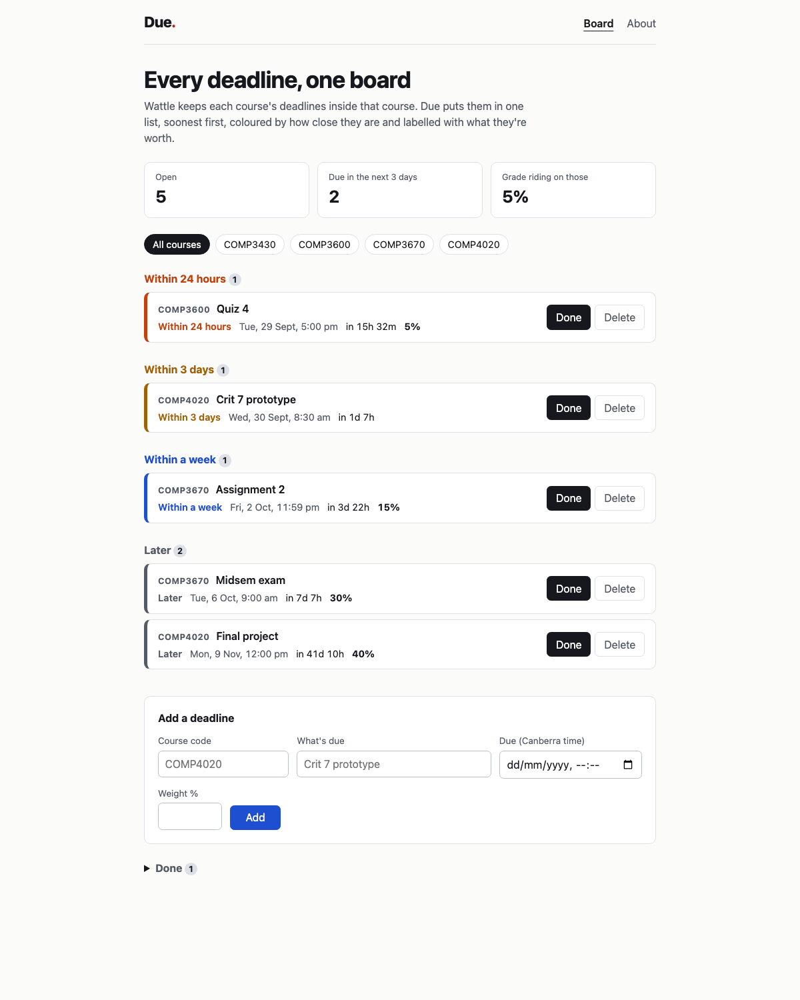

# Due: every ANU deadline on one board

Due is a deadline board for ANU students. Wattle files each deadline inside its
own course site, so answering "what's due next, across everything I'm taking?"
means opening four or five courses and doing the sorting in your head. Due is
the one view Wattle doesn't have: every deadline from every course in a single
list, soonest first, grouped by how close it is, with the share of the grade
riding on it written next to it. You add a deadline once (course code, what's
due, when, weight) and it stays on the board, in SQLite on the app's volume,
until you tick it off or delete it.

## What good looks like here

Good here means the board answers two questions at a glance: **what bites
next** and **how much it's worth**. Everything else was cut against that.

- **Urgency is the main signal, not the date.** Open deadlines fall into five
  bands (overdue, within 24 hours, within 3 days, within a week, later), each
  with its own colour and a written label, so the ordering doesn't depend on
  colour alone. The summary row counts what falls in the next three days and
  adds up the weight riding on it, because that's the number that decides
  tonight.
- **Canberra time, always.** ANU publishes every deadline on Canberra time, so
  the board stores and compares times on that clock and says so on the form.
  A deadline entered as 08:30 is 08:30, whatever timezone the browser thinks
  it's in.
- **The data model is the real one, just smaller.** A course has many
  deadlines; a course code has the ANU shape (four letters, four digits), and
  that rule is held twice: by the form handler, which explains the mistake, and
  by a `CHECK` constraint in the schema, which refuses a bad row even if the
  handler is bypassed. Weight is a whole percentage or blank, also enforced in
  the schema.
- **It works without JavaScript.** Every write is a plain form POST that
  redirects back to the board, so adding, ticking off and deleting all work
  with scripts off. The only script refreshes other open tabs over a
  server-sent-events stream, and it won't throw away a half-typed deadline to
  do it.

What I chose not to build: accounts and sign-in (it's one board per
deployment, which is honest for a prototype and keeps the slice to the part
that annoys me), importing from Wattle (no API a student can reach), and
reminders or notifications (the board is the reminder). Recurring deadlines,
like weekly labs, are added one at a time.

What's enforced and what's judgement: `spec/deadlines.test.ts` drives the built
server over HTTP and holds the mechanical promises: a deadline you add is
there after a reload and after the server restarts on the same database,
ticking it off persists, the board is soonest first, each open deadline carries
its urgency label, and a malformed course code is refused and not stored. The
starter's invariants check the accessibility floor on every route. Whether the
bands are the right bands, and whether the board is calmer to read than Wattle,
are judgement calls, and they're the ones I'd most like argued with at the crit.
